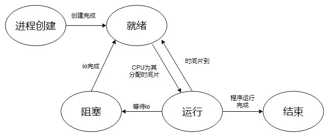
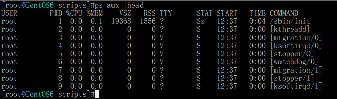

# linux进程管理

### 一.进程相关概念

#### 	1.进程与程序的关系

​	首先区分一下进程和程序的概念,程序是一种静态的,是一个文件或者是一组文件的集合,存储在硬盘中,当用户需要时用该程序时,利用操作系统的交互界面运行程序,此时程序会被载入内存,由操作系统为其分配内存空间,然后操作系统还会维护一段数据用于描述该程序的一些状态,就像文件的元数据一样,在Linux中操作系统会创建一个task_struct的数据结构用于存放这些,此时在内中的这些数据被称为是一个进程

#### 	2.进程的创建

​	首先,进程是有父子关系的即每一个进程都是由另外的一个进程创建的,当然在操作系统启动的时候会创建其老祖进程,在CentOS6中该进程是init而在CentOS7中这个进程是systemd在Linux中创建进程主要使用了两个函数fork()和clone(),关于这两个函数这里不做具体阐述,因为我也不了解其内部机制,创建进程使用的是一种叫做写时复制(CoW)的机制来创建进程的,这种机制是比较节省资源的,在进程创建之初系统并不会真正的为其分配内存,而是与其父进程,即创建该进程的进程以只读的方式共享同一块内存,当子进程需要写入数据的时候操作系统才会复制一份父进程的内存空间到其他地方给子进程,这里就有点类似lvm中的快照了

#### 	3.进程的状态

​	众所周知,虽然现在的操作系统同时可以运行多个程序,但是在同一个CPU上,某一个时间点上只有一个进程在运行,我们看到的多个进程同时运行其实是一个假象,CPU是通过时间片的方式来运行多个程序的,即某一个时间段运行一个进程下一个时间段运行另外一个进程,这个时间段是以毫秒为单位进行分配的,因此我们人类根本感觉不到他的切换,这里也就引出了一个问题,进程的状态切换,用下面这张图加以说明:

​	

以上这张图中需要强调的是进程进入阻塞状态时,当io完成时不可以直接进入运行状态必须先进入就绪状态,等待系统为其分配时间片才能执行,当然上图中只是常见的一些状态的转换过程,还有其他的状态,比如有一个需要关注的状态将僵尸态或者叫孤儿进程,这个进程形成的原因是当某一个进程结束时没有能够正常的处理其子进程,导致子进程既没有被正常结束,也没有成为其他进程的子进程,导致这个进程没有父进程,这样这个进程不但不能正常执行而且还占用着内存资源

#### 	4.进程优先级

​	在Linux操作系统采用的是抢占式的多任务,系统有n多个进程,有很多是特别主要的,有一些会次一点,这里就像我们现在的社会一样,进程是有优先级的,而且系统有那么多进程需要运行,当当前进程的CPU时间片到了之后决定下个时间片分给哪一个进程是一件很头疼的事,这样就为其分配一个优先级,当然如果决定下一个时间片分给谁的时候再去比对每一个进程的优先级,显然是一件特别浪费资源的事情,在Linux中系统的开发者也非常巧妙的处理了这个问题,那就是分配队列,将优先级相同的进程放到同一个队列中这个队列叫运行队列,这样下次切换进程的时候先决定执行哪一个优先级然后找到其队列然后直接执行队列中的第一个进程,时间片到了将这个进程放入另外的一个队列,该优先级的过期队列,等待优先级队列里的进程数为0的时候再将这个过期队列转换为运行队列,另外这个进程的优先级并不是一个绝对的概念,而是相对的CPU多去执行它,当然具体的决策过程这里不做阐述

### 二.进程管理工具

​	**1.*ps***这个ps可不是Photoshop而是process state,即进程状态,这个工具主要的作用就是查看系统中的进程及其一些属性信息,可能是由于历史的原因吧,这个工具有三种选项风格:UNIX风格,BSD风格,GNU风格,下面就对其选项进行说明,默认情况下只显示当前终端中的进程

```bash
	BSD风格:
		a:包含所有终端中运行的进程
		x:和终端无关的进程
		u:显示更详细的信息
		f:树状显示进程父子关系
		k/--sort 属性:对属性排序属性前加-表示倒叙
		o:只显示特定的属性,各个属性用逗号分隔,注意此选项不能和u共用
		L:显示支持的属性列表
		Z:显示SELinux相关
	UNIX选项:	
		-e:显示所有进程
		-f:显示完整格式列表
		-F:比f更详细的
		-H:层级显示进程的父子关系
		-u:指定有效用户ID或名称
		-U:指定实际用户ID或名称
		-p:显示指定pid的进程
		-M:显示SELinux相关属性
		-C:指定程序的进程列表,注意,脚本中如果不加shebang头,进程中的命令就变成了bash,如果使用
		   bash script_name运行的程序,进程列表中显示的是bash script_name
```

以下是一个示例:



下面对上图中各列进行解释:

			PID:进程的PID
			PPID:父进程ID
			TIME:该进程累计CPU时间片的总和
			TTY:程序运行在哪个终端上
			STAT:进程的状态
				D:不可中断睡眠,通常在等待IO完成
				R:运行或者可运行,在运行队列中
				S:可中断睡眠,等待事件完成
				X:已经执行结束的进程,不可能出现?
				Z:僵尸进程,由于其父进程不负责任,父进程终止后子进程没有被同时终止,
				或者没有重新为子进程找好父进程
				<:高优先级
				N:低优先级
				l:是多线程的
				L:将页锁定在内存中,用户实时或者自定义IO
				+:位于前台进程组中
				s:子进程的发起者
			COMMAND:运行的程序
			%CPU:占用CPU的百分比
			%MEM:占用内存的百分比
			START:进程启动时间
			VSZ:操作系统允许使用的最大内存
			RSS:目前使用的内存
			EUSER:现在程序正在运行时使用的用户,可能该程序被设置了suid权限,
			RUSER:进程的发起者,和USER显示的一样,可以理解成RealUser
			ETIME:进程启动了多长时间
			PSR:当前进程运行在哪个CPU上
			PRI:系统优先级反过来,priority优先级
			NICE:nice优先级-20-19
			RTPRIO:实时优先级
​	**2.*pgrep*:搜索进程,支持正则表达式**,使用格式 pgrep [option] pattern

		-l:显示进程名称,比较简洁
		-t:显示进程pid
		-a:显示完整名称
		-P pid:显示某个父进程中的子进程	

​	**3.*pidof***,显示某个进程对应的pid

​	**4.*kill***:这个命令主要是可以向进程发送信号,用法:kill [-SIGNAL] pid,SIGNAL是信号,是一个数字,下面对各数字及其含义做解释

> ​			1/SIGHUB:让进程重读配置文件
>
>   			2/SIGINT:相当于执行Ctrl+c
>
> ​			3/SIGQUIT:相当于Ctrl+\,退出
>
> ​			9/SIGKILL:强行杀死进程
>
> ​			15/SIGTERM:正常退出进程,默认是15
>
> ​			18/:继续运行信号
>
> ​			19/SIG:发送休眠信号

和kill功能差不多的还有两个命令:killall和pkill,killall是给所有该进程名的进程发信号pkill可以使用扩展的正则表达式匹配相应的进程名

​	**5.进程的前后台切换**:

​		COMMAND &:COMMAND是要执行的命令在其后面加上&,这个命令就会在后台显示,但是其标准输出还会输出到屏幕上

​		Ctrl+z:将正在进行的程序进行休眠,并放入后台

​		fg job_id:将后台程序切换到前台并进行执行

​		bg job_id:将后台休眠程序激活仍然在后台执行

​		jobs:查看当前终端中运行的后台程序和后台休眠程序,在这里就可以查看到其job_id

​	4.并行执行多个命令:

​		1.在每个命令后都加上&

​		2.(COMMAND1 &);(COMMAND2 &);(COMMAND3 &);...

​		3.{ COMMAND1 & COMMAND2 & ...}


