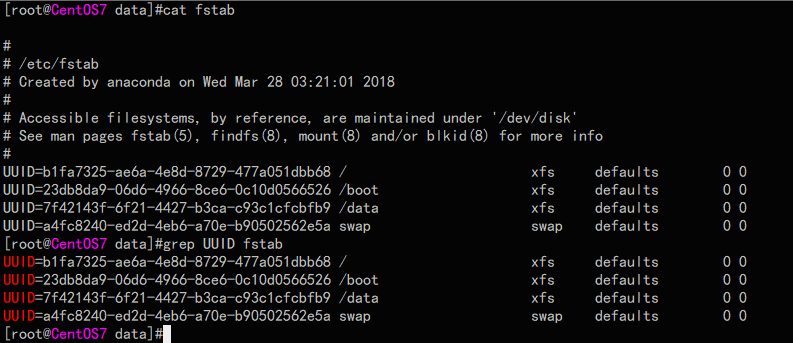
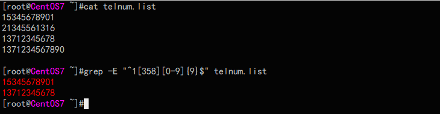
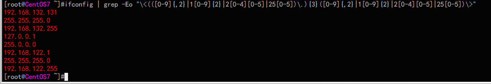

# grep 和正则表达式
### grep

​	全称:Global search REgular expression and Print out the line文本过滤工具,按行显示出含有某个特定字符的工具,该工具最大的特点肯定是支持正则表达式,他还有两个按名字上来看算是一奶同胞的兄弟,egrep和fgrep,egrpe支持扩展正则表达式,而fgrep就不同了,他不支持正则表达式,由于grep提供了两个选项-F和-E分别可以完成fgrep和egrep的功能,所以这里仅讨论一下grep的用法

​	grep语法:*grep [OPTION]... PATTERN [FILE]...*

​	首先用一个最简单的例子展示一下这个工具的作用

​	

​	得解释一下,这个匹配到的字符被标红了,并不是工具默认就有的选项,而是需要特定的选项--color=auto,才能将匹配的字符标红的,我这里用的是CentOS7,系统默认创建了该命令的别名grep="grep --color=auto",

​	下面主要列一下这个工具的常用选项:

| 选项 | 作用                                          |
| ---- | --------------------------------------------- |
| -i   | 不区分大小写                                  |
| -o   | 仅显示匹配到的字符,默认会显示匹配到字符的整行 |
| -w   | 匹配整个单词                                  |
| -E   | 支持扩展的正则表达式                          |
| -v   | 显示没有被匹配到的行                          |
| -n   | 显示行号                                      |
| -c   | 统计匹配到的行数                              |
| -G   | 使用基本的正则表达式                          |
| -F   | 不使用正则表达式                              |
| -P   | 使用Perl的正则表达式                          |
| -e   | 或者 str1 -e str2即包含str1或者str2           |
| -q   | 静默模式,即无论匹配到还是没有匹配到都不显示   |
| -A n | 显示匹配到的行和其之后的n行                   |
| -B n | 显示匹配到的行和其之前的n行                   |
| -C   | 显示匹配到的行和其之前的n行之后的n行          |

下面详细介绍一下以上的某几个选项

​	-w:grep不会去验证一串英文字母到底是不是单词,而是仅仅把英文字母的组合还有含有下划线的英文字母组合当成是一个单词,比如grep-is-good,grep_is_good会认为grep_is_good认为是一个单词,而grep-is-good会认为是三个单词,下面来看一下两个示例的对比

首先查看了grep1中的内容,4行内容都含有good字符串,在不加任何选项去匹配的时候,四个都匹配到了,

而加了-w之后,只匹配到了good行和grep-is-good行,因此看来grep把grep_is_good也看成了一个单词,因此并没有匹配到

​	-q:静默模式,这个选项主要是用在写脚本的时候,当判断某一个文件中是否包含有某个字符就比较有用了,无论检查到没有他都不会在屏幕上显示内容,当然bash提供了$?这个变量,他保存了上一条命令的执行状态,0代表成功,1-255表示各种错误,当然你觉得-q不够装逼还可以用重定向将结果重定向到/dev/null中

​	-A,-B,-C:当然有些人会觉得这三个选项没有意义,想看哪行直接匹配哪行就行了嘛,干嘛还整这个,其实在 有些特定的场景中,我们无法提前获得你要匹配到的行的,这样就可以通过这三个选项解决了

### 正则表达式

​	英文名REGEX,无论从从中文还是英文,我们好像都无法从字面上来解释这个名词,下面说一下我对正则表达式的理解:正则表达式程序将某一些一些字符(在正则表达式中称作元字符)或者字符组合予以特殊含义,以此通过将这些特殊字符的组合来表达含有某种格式的字符串,这样就可以从一些杂乱的字符集合中找到我们想要的内容,然后通过其他的程序对这些字符串进行处理或者利用,正则表达式是通用的,常见的编程语言,以及某些工具,软件都支持正则表达式,因此这也算是一个挺重要的东西,在Linux下可以查看regex第七章的man帮助

​	**正则表达式引擎**:

​	就是负责做这件事的程序模块,虽然说正则表达式是通用的,但是在某些细节上不同的编程语言,工具等,还是有一些细微的差距的,就像是浏览器一样,虽然Chrome,Firefox,IE都可以打开网页,但是可能同一个网页在不同的浏览器上的效果展示会不同.这个是很正常的,不过正则表达式肯定没有浏览器兼容那么恶心

​	**元字符的分类**:

​	字符匹配,匹配次数,位置锚定,分组

下面将常用的元字符做总结:

**字符匹配:**

​	.:代表任意一个

​	[]:匹配指定范围内的任意一个字符

​		例:[a-z],[A-Z],[0-9],[abcd]...

​	^:表示非该范围内的任意字符,注意这个^的用法,下面还会介绍他的另一个功能

| 元字符    | 作用                                                         |
| --------- | ------------------------------------------------------------ |
| .         | 任意的一个字符                                               |
| []        | 该范围内的任意一个字符,可以使用-分隔表示范围:比如[a-z]表示所有的小写字母,当然需要匹配-的时候需要用\转义,即\- |
| ^         | 非,表示非某个字符或者某一个范围内的字符,当然^还有另外的一个作用后面会在其他分类中介绍 |
| [:digit:] | 任意一个数字和0-9表示的含义一样,注意这个中括号,是元字符本身的一部分,并不是上面指定范围的[],例如想表示0-9和-的任意一个字符需要写成[[:digit:]\\-],而不能写成[:digit:\\-] |
| [:alpha:] | 表示任意一个大小写字母                                       |
| [:upper:] | 表示任意一个大写字母                                         |
| [:lower:] | 表示任意一个小写字母                                         |
| [:alnum:] | 表示任意一个大小写字母和数字                                 |
| [:space:] | 表示一个空格字符或者一个tab字符                              |
| [:punct:] | 表示任意一个标点符号                                         |

​	注意:以上这类[:digit:]...的元字符可能是Linux中特有的,其他地方的正则表达式并不一定含有这些元字符

**次数匹配:**

| 元字符    | 作用                                           |
| --------- | ---------------------------------------------- |
| *         | 表示其所修饰的字符可以出现任意次,即0次或者多次 |
| \?        | 表示0次或者1次                                 |
| \\{n\\}   | 明确的表示n次                                  |
| \\{n,\\}  | 表至少n次,即n次或者更多次                      |
| \\{n,m\\} | 表示n次到m次之间                               |
| \\{,n\\}  | n次之内,即表示0次到n次                         |

**位置锚定:**

| 元字符 | 作用                                                         |
| ------ | ------------------------------------------------------------ |
| ^      | 表示其后面的字符属于一行的开头,如果有[]要写在[]的外面,否则会表示成上面说的非[]中的字符 |
| $      | 表示其之前的字符是一行的结尾                                 |
| \\<    | 表示其后面的字符是单词的首部,例如\\<w表示以w开头的单词       |
| \\>    | 表示其前面的字符是单词的尾部,例如d\\>表示以d结尾的单词       |
| \\b    | 表示单词的边界,即,既可以表示头部也可以表示尾部               |

**分组:**

​	分组其实就是用()包起来的字符被看做是一个分组,分组的主要作用就是当后面要匹配的字符和前面已经匹配到的字符相同时就可以使用()将前面的字符分组,在后面使用\n来表示,n代表的是第几个分组,从左数第几个左括号就表示的是第几个分组,比如(ab(cd)),\1代表的是abcd\2代表的是cd,一定要分清,分组\n代表的是前面匹配到的内容,而不是模式本身,

​	另外一个和分组类似的就是|,他代表的是或的关系,比如(a|b)这就代表a或者b当然如果后面不需要使用分组其实他的作用和[ab]的作用是一样的,需要注意的一点就是,b|dig,这个代表的是b或者dig,而不是我们想象的big或者dig,如果想代表big或者dig就需要使用(b|d)ig或者[bd]ig了

​	以上就是我们经常会用到的正则表达式的元字符,有了这些基础,这里就可以讨论一下正则表达式的另外一个重要的概念:**贪婪模式**和**懒惰模式**

​	**贪婪模式:**顾名思义,就是比较贪心,他会尽量的多的去匹配字符

​	**懒惰模式:**肯定是和贪婪模式相反了,他是只要匹配到就可以了

​	比如说有这样一个字符串:abcddddddd,我们使用这个正则表达式:abcd*,如果是贪婪模式他会匹配到abcddddddd整个字符串,而懒惰模式则只匹配到abcd就不在继续匹配了,在Linux中默认使用的是贪婪模式

​	看了资料说将懒惰模式变成贪婪模式是在其后面加\?比如说上面的例子如果写成abcd*\?就代表的是处于懒惰模式即只匹配到abcd,但是这种写法在Linux中我使用grep测试这样写好像并不灵验,如果想匹配更少的次数,可以使用次数匹配

在上面讨论grep的时候提到过egrep即**扩展的正则表达式**,其实这个很简单啦,就是使用扩展的正则表达式后大多数元字符不用加\转义了,但是有个别的比如\\<,\\>,\\b还是需要加的

最后用几个示例感受一下正则表达式的魅力

​	匹配手机号:

​	

​	匹配ip地址:

正则表达式非常灵活,有很多种写法,而且对于不同的场景也许需要不同的调整,没有固定的写法,以上内容为个人学习总结,存在各种不尽人意的地方还望大家多多指正